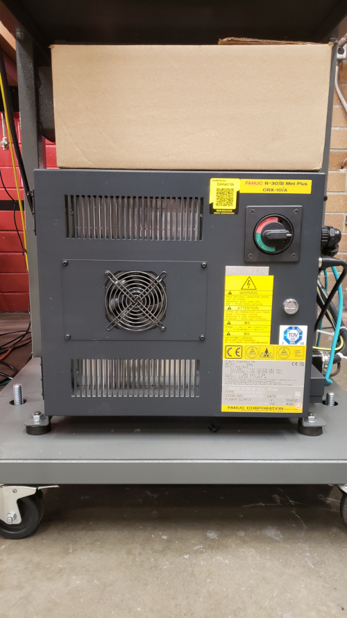
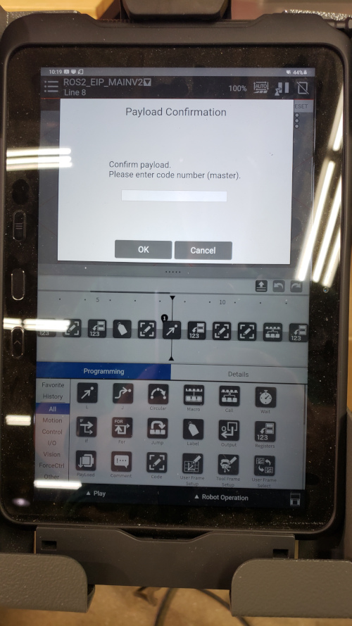
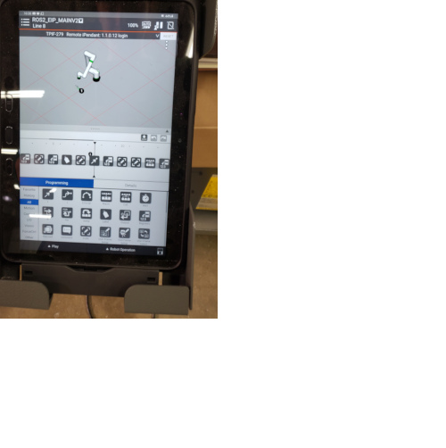
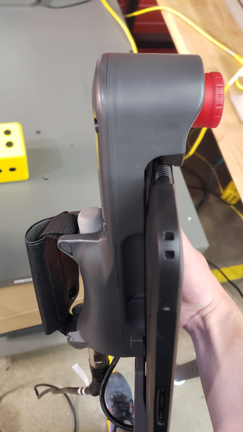
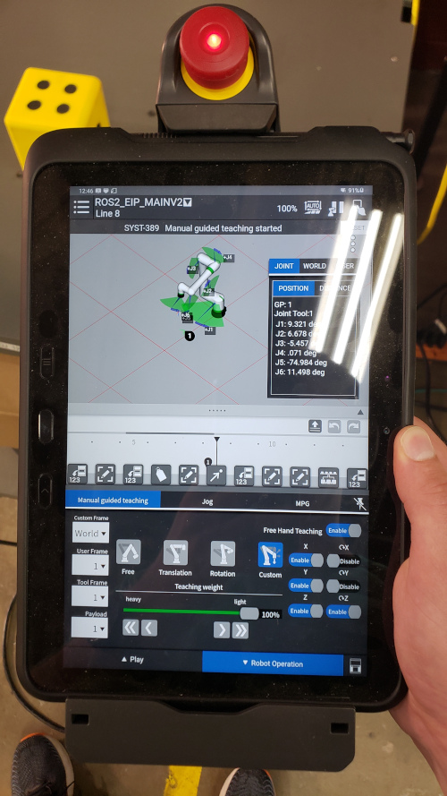
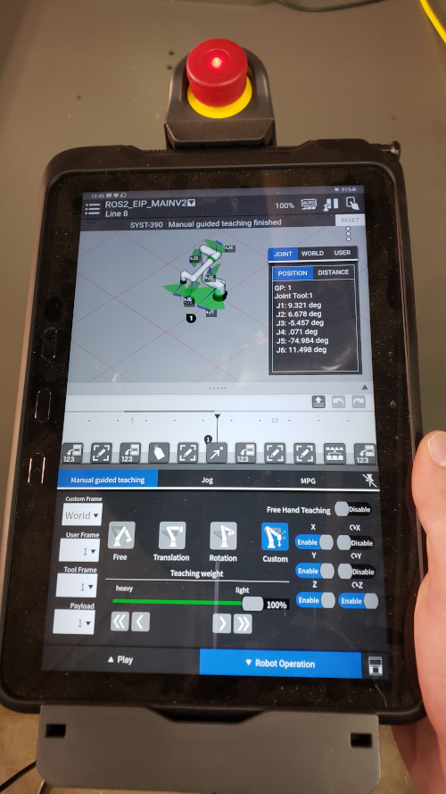

# Boot Sequence and Basic Usage

### Table of Contents

| Section | 
| :---: | 
| [Boot Sequence](#boot-sequence)
| [Manual Guided Teaching](#manual-guided-teaching)

# Boot Sequence

1. Turn robot controller switch to "on", matching the second image below.

2. After TP boots, enter `1111` on TP when asked for key. After entering the code you will have to confirm several more payload screens. In most cases you won't have to worry about these settings. Occasionally payload confirmation will be rejected because of disturbance (vibration). In this case, verify that the robot is not moving, firmly attached to its base, and not in contact with anything else that might be moving. Then restart the robot controller by turn the switch off and then back on. Attempt to confirm payload. This may have to be done several times.

3. Next, clear any warnings on the TP in the top right corner of the interface by pressing the gray button next to the message that says 'reset' or 'clear'. Note that any time there is an uncleared error on the TP it will prevent certain user actions making it a good idea to first check for uncleared errors when experiencing problems.

4. Enable TP by tapping the icon of a hand over a rectangle in the top right corner of the TP interface. Note that after enabling the TP, you will not be able to do anything until the yellow 'TP enabled' warning is reset/cleared. Enabling the TP is necessary for programming, jogging, and other user interface options that control the robot.

# Manual Guided Teaching

1. Press and hold button on back of TP down one click to enter manual guided teaching mode.

2. Look for the flashing green light on the base of the robot arm to verify that you are in manual guided teaching mode.
3. Now, while keeping the button depressed, move the robot arm so that it is positioned as desired.
4. To record the position, enter the TP editor and create a new movement. By default the position of the movement will have the robot's current position.
5. Alternatively, open world frame/coordinate screen and examine the tool coordinates or joint positions.

#### Notes

_**If you don't wish to depress the button while moving the robot**_, toggle the free-hand teaching option in the menu. You will see that after enabling this option, the light on the base of the robot flashes continuously, even when the button is not pressed.

Also note that _**if the robot is difficult to move in manual teaching mode**_ it may be because the teaching weight is set to heavy. To decrease force required to move robot and get it to move faster, adjust the slider at the base of the menu screen.

