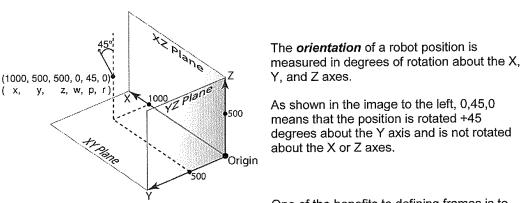
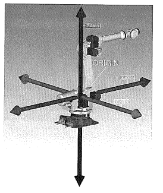
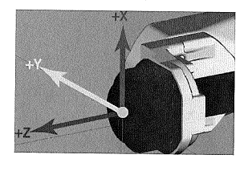
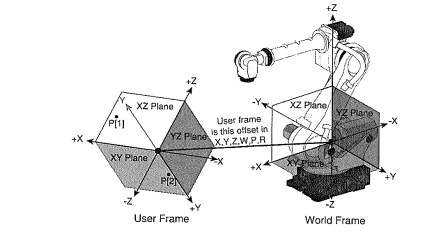
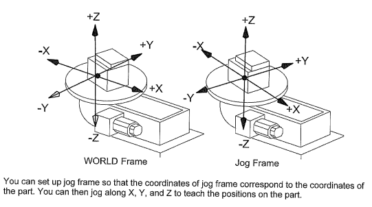
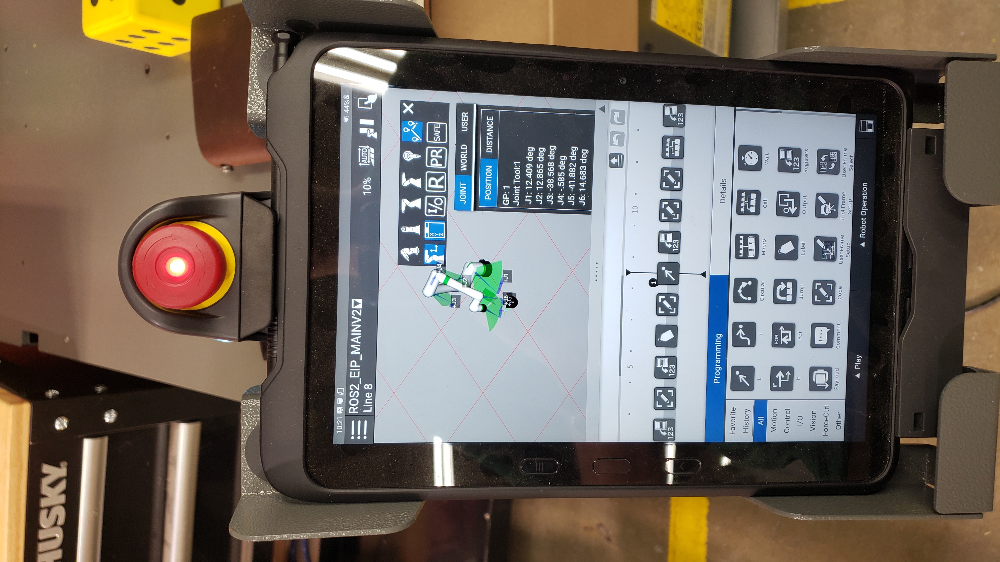

# Robot Coordinate Systems and Frames 

Fanuc defines frames as:

> Frames are used to describe the location and orientation of a position in three-dimensional space. The location is the X, Y, and Z directions from the origin of the reference frame. The orientation is the rotation about the X, Y, and Z axes of the reference frame. When you record a position, its location and orientation are automatically recorded as X, Y, Z, W, P, and R relative to the origin of the frame it uses as a reference.

 

#### Types of Frames 

| Frame | Description | Manual Reference |
| :---: | :---: | :---: | 
| World | The reference frame which all positions are relative to. Origin at intersection of J1 axis with J2 axis. | Section 10.4, page 115 / page 129 (pdf) |
| Tool  | Describes orientation and location of tool. Defined relative to center of faceplate on end of arm. | Section 10.5, page 115 / page 129 (pdf) |
| User  | Frame taught by the programmer for defining robot movement. If not defined, World frame is used. | Section 10.7, page 135 / page 149 (pdf) |
| Jog   | Frame set with any location or orientation. Recommended for defining how the robot should move relative to a part which doesn't align with the world frame. | Section 10.9, page 147 / page 161 (pdf) |
| Cell  | Described as being used for 3D graphics, but not documented outside of Frame overview. | |

## Frame Illustrations

#### World 

 

#### Tool 

 

#### User

 

#### Jog 

 

## Viewing Frame Relative Position on TP 

If you want to view the robot position relative to a frame follow the steps below on the Teaching Pendant (TP).

1. From the robot render screen, select the three dots at the top right of the render view, positioned directly below the TP enable button and error reset button in the image below.

2. After selecting you should see a menu replace the three dots. From this menu select the square with XYZ in it. You should see a sub menu with selectable tabs that show the positions of the robot in world and user frames. The joint positions are also shown.

