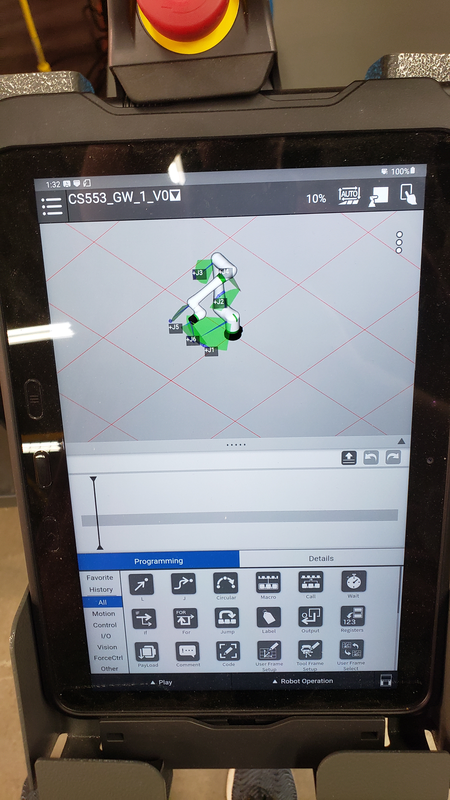
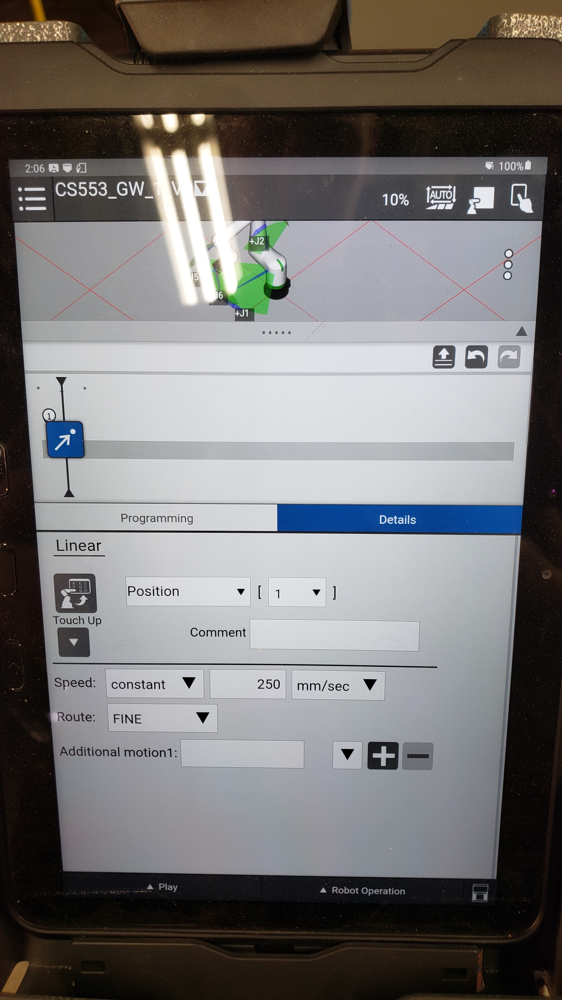
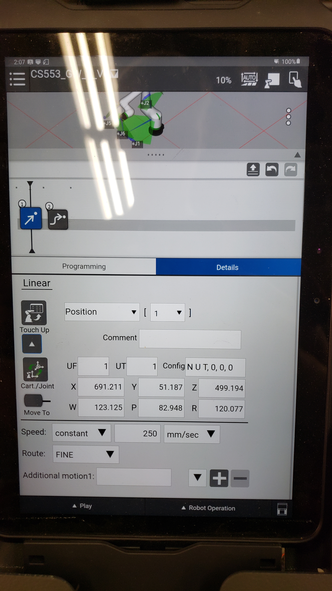
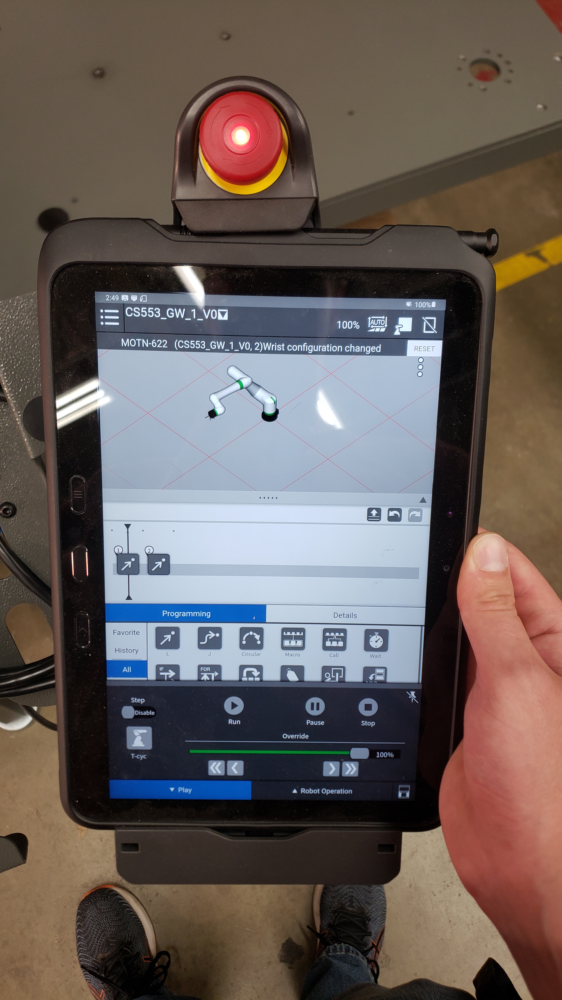

# Teach Pendant Block Language Programming 

This guide covers the basics of creating and editing TP programs on the Fanuc teaching pendant.

# Menus and Important Buttons

# Creating a Program

1. Start the robot and log in.
2. Access the main menu using the three lines with dots next to them in the top left corner of the application.

3. From main menu select `Teaching -> Select Program`.

4. You should see the menu below open. On the left there are options to open, create new, and delete programs. Select New.

5. Create a new program and name it. _**NOTE:**_ for class projects, please use the convention `<class #>_<your initials>_<project number>_<version number>`. Note that program names must start with a letter and not contain any special characters, just letters, numbers and underscores.

# Editing Your Program and Fine-Tuning Actions

Basic workflow:

1. Enable teaching pendant using the button in the top right corner of the interface. Make sure to clear all warnings.
2. Guide robot to desired location with manual guided teaching or by jogging.
3. Click and drag action from programming menu and place in editor space.

Before creating action:

After creating action:

4. Edit action to fine-tune motion profiles, positioning, etc. To edit action details, tap on an action in your program. 

Tapping the drop-down arrow below `Touch Up` in the Details panel will reveal fields for editing User Frame (UF), User Tool (UT), and robot position and orientation parameters.

5. To verify your program, open play menu by tapping `Play` at the bottom of the screen next to `Robot Operation`, make sure teaching pendant is disabled, and press play. Use the speed slider to modify how quickly the robot performs the movements in your program. 

# Opening Existing Program

1. Open `Main Menu -> Teaching -> Select Program`.
2. Tap program from menu to select. Then tap open on the right side of the screen. From here you should be able to edit your program while the TP is enabled and run your program as well.

# Notes

#### A Warning About Tool & User Frames

Each action is created with an associated User Frame (UF) and User Tool (UT). These specify the frames used to plan robot motion and give context to the robot position and orientation goal specified by the currently selected action. This means they are not the same as the UF and UT set for the robot controller and if they do not match when the action is executed, an error will be thrown halting program execution.

If you experience this problem, open `Robot Operation -> Jog` and set the UT and UF fields to match those of the actions in your program.

Note that your program can also select the UF for the program to use through an action in the block language.
