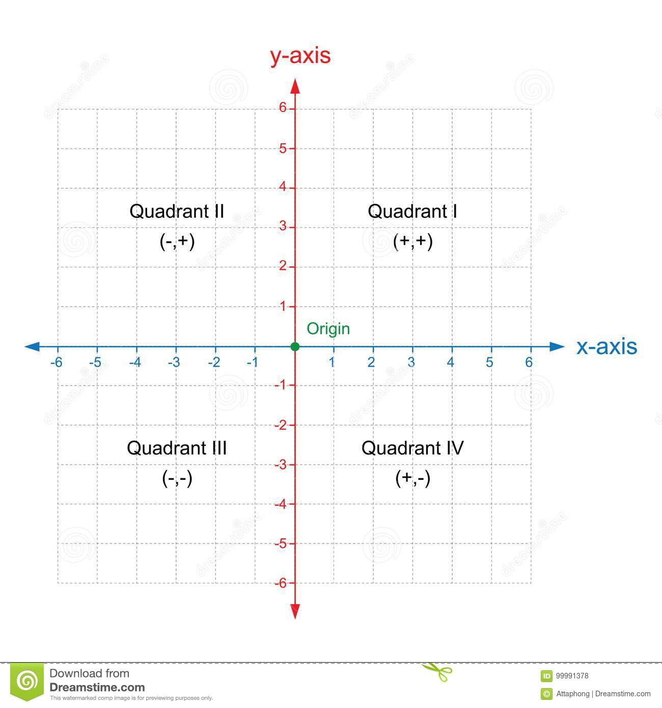

# Garrett Coordinate System Definition
For the coordinate system we will use the general X-Y axis Cartesian Coordinate System.

| Details | Description | 
| :---: | :---: | 
| Coordinate System | X-Y axis Cartesian Coordinates |
| Units of Measurement | Metric (mm, cm, m), where the default unit of distance, if unspecified, should be assumed to be a millimeter | 
| Orientation | If being used independent of a real world system, this doesn't matter. If being aligned with another system, assume X positive to be East and Y positive to be North. |

## Robot Spacing
Each robot is 341.9mm in diameter. The starting points for each robot are listed below, assuming that there are no more than four robots at a time.

| Robot | Distance to Center of Robot(mm) |
| :---: | :---: |
| #1 | 0mm |
| #2 | 30cm + 342mm = 642mm |
| #3 | 1284mm |
| #4 | 1926mm |

Since it is very difficult to consistently align the center of your robot with a center point marked on the floor, I would recommend marking a box roughly the same size as the robot on the floor
to make sure that it starts from the same location for each test.
