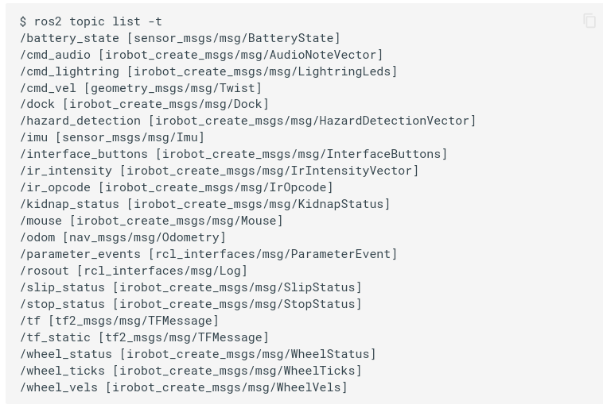

# iRobot Create3 Setup Guide

Follow this document to install ROS2 and setup a ROS2 connection with the iRobot Create3. It is recommended that you follow the installation process outlined below, and refer to the documentation provided by ROS2 and iRobot for detailed instructions. Refer to this document for quick reference as needed.

### How to Follow This Guide 
There are three main steps in this guide:

1. Install ROS2 
2. Setup/configure the iRobot Create3
3. Install iRobot Create3 Dependencies/Libraries

The steps may be performed in parallel or individually, and are fairly independent of each other. Verifying installation for steps two and three require having ROS2 installed first, so that is the recommended starting point here.

### Extra Resources for Learning ROS2
If this is your first time using ROS2, you will likely want to read through/follow the beginner tutorials provided by ROS2 which introduce the `ros2` command line interface, package system, and `colcon` build system. These tutorials are linked in the [documentation links](#documentation-links) below and are most helpful after installing ROS2. ROS2 is **not** an intuitive system at first glance with several quirks (cough _sourcing_ cough _workspaces_ cough) that may make it seem like black magic, but the tutorials and documentation go a long way towards pulling back to the curtain, so to speak.


## Table of Contents
1. [Documentation/Tutorial Links](#documentation-links)

2. [Setup Guide](#setup-guide)
	1. [ROS2 Installation Guide](#ros2-installation)
	2. [iRobot Create3 Configuration Guide](#irobot-create3-configuration-guide)
	3. [Installing ROS2 iRobot Create3 Dependencies](#installing-ros2-irobot-create3-dependencies)
	4. [Verify ROS2 & Create3 Connection](#verification)


# Documentation Links
| Link | Description | 
| :---: | :---: | 
| [ROS2: Humble Hawksbill Documentation](https://docs.ros.org/en/humble/index.html) | Latest ROS2 version (as of Fall 2022) | 
| [ROS2: Humble CLI Tutorials](https://docs.ros.org/en/humble/Tutorials/Beginner-CLI-Tools.html) | Introduction to command line tools provided by ROS2 for _debugging!_ | 
| [ROS2: Humble Client Lib Tutorials](https://docs.ros.org/en/humble/Tutorials/Beginner-Client-Libraries.html) | Introduction to ROS2 library creation and build systems. |  
| [ROS2: All Tutorials](https://docs.ros.org/en/humble/Tutorials.html) | Tutorials for all experience levels whereas the two above are introductory. |
| [ROS2 Python API: rclpy](https://docs.ros2.org/latest/api/rclpy/index.html) | Python API for using ROS2 interfaces and writing custom ROS2 nodes. |
| [rclpy Examples](https://github.com/ros2/examples) | Python and C++ example code for nodes, topics, services, and actions. | 
| [iRobot Create3 Code Examples](https://github.com/iRobotEducation/create3_examples) | Examples of how to control the robot using command topics and actions. **Very** helpful. |
| [iRobot Create3: Getting Started Guide](https://edu.irobot.com/learning-library/create-3-getting-started) | Hardware documentation and setup guides for first steps. |
| [iRobot Create3 Documentation](https://iroboteducation.github.io/create3_docs/) | Detailed documentation for configuration and debugging. | 
| [iRobot Create3: APIs](https://iroboteducation.github.io/create3_docs/api/ros2/) | ROS2 API for Create3. |


# Setup Guide

## ROS2 Installation


Install ROS2 'Humble' or newer on a linux machine. For installation instructions and latest release go [here](https://www.ros.org/blog/getting-started/). Make sure to install the latest *ROS2* version, not *ROS1*. They are both listed on the linked page. If you like, test your installation by running the `turtlesim` publish/subscribe example at the end of the ROS2 installation guide. A good follow-up to this example is following the CLI and Client Library tutorials that are linked in the [documentation links](#documentation-links) above. These tutorials will continue to use `turtlesim` to illustrate the architecture used by ROS2 and introduce debugging tools.

If you have followed this guide before and simply want to connect to the Create3 as quickly as possible, see the install summary below.

##### Summary
This is a summary of [the ROS2 installation guide](https://docs.ros.org/en/humble/Installation.html) and [the colcon installation guide](https://docs.ros.org/en/humble/Tutorials/Beginner-Client-Libraries/Colcon-Tutorial.html).
Although not short, these installation steps will provide all the tools needed to use ROS2 on your system.

1. Verify locale is UTF-8: `locale`
2. Verify Universe repository enabled on system:
    1. `sudo apt install software-properties-common`
    2. `sudo add-apt-repository universe`

3. Setup sources(ROS2 apt repository): 
	1. `sudo apt update && sudo apt install curl gnupg lsb-release`
	2. `sudo curl -sSL https://raw.githubusercontent.com/ros/rosdistro/master/ros.key -o /usr/share/keyrings/ros-archive-keyring.gpg`
	3. `echo "deb [arch=$(dpkg --print-architecture) signed-by=/usr/share/keyrings/ros-archive-keyring.gpg] http://packages.ros.org/ros2/ubuntu $(source /etc/os-release && echo $UBUNTU_CODENAME) main" | sudo tee /etc/apt/sources.list.d/ros2.list > /dev/null`

4. _**IMPORTANT:**_ ROS2 documentation notes that failure to update may cause catastrophic removal of vital system packages in Ubuntu 22.04.

		sudo apt update & sudo apt upgrade

5. Install ROS2 with: 

		sudo apt install ros-humble-desktop
		
6. Run:

		echo "source /opt/ros/humble/setup.bash" >> ~/.bashrc

##### Install CycloneDDS
CycloneDDS operates as the ROS2 middle-ware(RMW), which manages network communication between ROS2 nodes.
1. Run:

        sudo apt install ros-humble-rmw-cyclonedds-cpp

2. Next, instruct ROS2 to use CycloneDDS by exporting RMW_IMPLEMENTATION to to your system variables:

        echo "export RMW_IMPLEMENTATION=rmw_cyclonedds_cpp" >> ~/.bashrc

    * If you would like to verify that this is working, follow the 'Run the talker and listener' instructions at the bottom of [this page](http://docs.ros.org.ros.informatik.uni-freiburg.de/en/humble/Installation/DDS-Implementations/Working-with-Eclipse-CycloneDDS.html?highlight=cyclonedds).


##### Installing Colcon and Auto-completion
The steps below are necessary for coding your own ROS2 nodes and compiling them with the iRobot Create3 packages.

1. Install Colcon to build custom packages:

        sudo apt install python3-colcon-common-extensions

2. Setup `colcon_cd`:

        echo "source /usr/share/colcon_cd/function/colcon_cd.sh" >> ~/.bashrc
        echo "export _colcon_cd_root=/opt/ros/humble/" >> ~/.bashrc

3. Setup `colcon` auto-completion:

        echo "source /usr/share/colcon_argcomplete/hook/colcon-argcomplete.bash" >> ~/.bashrc


##### Installation Verification
_**TO VERIFY:**_ run `ros2 topic list`. You should see something like: 



You should **at least see /rosout and /parameter_events**. All other topics listed above are published by the robot, not seeing them may mean that they haven't been received yet(try running the command again) or that the robot isn't connected to your network. If there fewer outputs, follow [the robot configuration guide](#irobot-create3-configuration-guide) to connect the robot to your network and update the firmware. 

If you get the full output above, you have verified ROS2 is running and that the node running on the robot is visible to your machine.


## iRobot Create3 Configuration Guide
ROS2 communicates with the iRobot Create3 via a 2.4GHz network so we need to configure it to connect to the network we will be using. It will also be important to configure the robot with a unique namespace so that it can operate on the same network as other robots. To do so, follow the written instructions in [this guide](https://edu.irobot.com/create3-setup) and give it a namespace of the pattern `/create3-AP_NAME` (for example `create3-05F8`) where `AP_NAME` is the last four digits of the SSID broadcast by the robot. If this doesn't make sense, this should happen in section two, step two of the guide above (or see step 5 below).

###### _**IMPORTANT:**_ 
If you have assigned a namespace to your robot, all actions that you send to the robot **must start with the namespace**. For example, if your robot has the namespace `/create3_05F8` sending the dock command below will **not** work:

	ros2 action send_goal /dock irobot_create_msgs/action/DockServo "{}"

But this will:

	ros2 action send_goal /create3_05F8/dock irobot_create_msgs/action/DockServo "{}"


##### Summary
A summary of the configuration in that guide is included below (no firmware update):

1. With robot docked, press and hold buttons on either side of the power button until light turns blue and you hear a beep.
2. Connect to `Create-XXXX` network from laptop/desktop.
3. Open browser and navigate to access point(AP) `192.168.10.1`. This AP can later be reached if you know the IP address of the robot, this can be found by scanning the network with [Angry IP](https://angryip.org/), enabling the MAC address, MAC vendor fetchers, and looking for device from 'iRobot' vendor.
4. Once AP is reached, navigate to the 'Connect' page and use settings to connect to your desired network. 
5. Finally, navigate to the Application configuration page and change namespace field to `/create3_XXXX` where `XXXX` matches the last four digits of the network SSID broadcast by the robot. In reality, this namespace could be anything you want, but the convention is for easy of use in CS453/553.

###### _**NOTE:**_ 
The steps above don't include firmware update, so if firmware is older than `H0.0` (as of 12/12/2022), update. See iRobot documentation at this link: [firmware overview](https://iroboteducation.github.io/create3_docs/releases/overview/). 

## Installing ROS2 iRobot Create3 Dependencies
There are two steps that must be completed before your ROS2 instance on your computer will be capable of communicating with the iRobot Create3. The first step is to select the IP layer protocol used for transmitting packets from the robot to your machine. The default configuration used by iRobot is called CycloneDDS, but is not installed by default by ROS2. Installing and setting up CycloneDDS was covered in the first part of this guide under ROS2 installation.

The second dependency that must be installed is the library which defines the message types and valid contents accepted by the iRobot Create3 when enclosed in a CycloneDDS packet. To see an example of how a message `type` is formatted, try running `ros2 topic list -t` to see currently observed topics listed, followed by their type.

##### Install iRobot Create3 Messages
1. Clone repository to `/opt/ros/humble/src` with `sudo git clone -b humble https://github.com/iRobotEducation/irobot_create_msgs.git`
2. Follow the steps in the verification guide below to make sure that this is used correctly. If you experience problems, try cloning to the `create3_examples_ws/src/` directory that you create in the verification guide.

###### _**NOTE:**_
1. There are significant differences between robot firmware and the Create3 Messages API exposed by the ROS2 package above for certain versions. These differences may break functionality by removing or adding supported topics and actions by changing the name/type of certain interfaces. To avoid headache, make sure your installed firmware matches the version of Create3 Messages API you have installed. 
2. It is also possible to install the messages package in a ROS2 workspace every time you need it. This may help you stay up to date on changes to the package and API, but is not necessary and will add the step of cloning the package to your workflow for each new project.

It is also possible to compare the interfaces exposed/published by the robot with `ros2 <topic/action/service> list -t` to print message types for comparison with the interfaces defined in the Create3 Messages package. If the interface **name** or **type** is different from the robot, you will likely be unable to use that interface. To view all information about an interface installed in a package on your machine first source the workspace then use the command `ros2 interface show <interface-type-here>` to view argument types and structure.

## Verification
The final step is to verify connection between your laptop and the robot. To do this we will install and run the coverage example from [iRobot's Create3 examples repository](https://github.com/iRobotEducation/create3_examples). Follow the instructions in the README of that repository to create and install a new workspace, then follow the directions in `/create3_coverage` to run the example. If successful, your robot will undock and begin driving across the floor until it hits an obstacle.

##### Summary
1. _**Installation**_, do once. Run the following in any directory you wish, but `/home/<user-name>/Documents` aka `~` is recommended.

	``` bash
	mkdir -p create3_examples_ws/src
	cd create3_examples_ws/src
	git clone -b humble https://github.com/iRobotEducation/create3_examples.git
	cd ..
	rosdep install --from-path src --ignore-src -yi
	colcon build 
	```

2. _**Initialization**_, must be done every time a terminal/session is opened for working on this project. DO NOT run the commands below in the same terminal you executed the build command in. Open a new terminal session and run: `source ~/create3_examples_ws/install/local_setup.sh`

	1. In first terminal run: `ros2 run create3_coverage create3_coverage`. This creates a new ROS2 node on your computer from which you can issue commands to the robot.

		* _**Note:**_ if you have set a namespace for your robot, you will want to run the line above as `ros2 run create3_coverage create3_coverage --ros-args -r __ns:=/<create3-namespace>`
	
	2. In a second terminal: `ros2 action send_goal robot_namespace_here/coverage create3_examples_msgs/action/Coverage "{explore_duration:{sec: 500, nanosec: 0}, max_runtime:{sec: 1000,nanosec: 0}}"`. This command publishes a command for the robot to fulfill. If the task hangs, with no response from the robot to signal that the command as been received or accepted, verify that you are publishing to the correct namespace such as `create3-0F58`.
